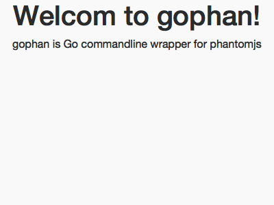

# gophan

gophan is Go commandline wrapper for [`phantomjs`][phantomjs]

[phantomjs]: http://phantomjs.org/

# Install
You do not need to install phantomjs using package manager such as apt-get or brew.
Because gophan is embedding the phantomjs binary for windows and linux and linux in the program using [go-bindata][go-bindata].
So you can install it with the following command only:

```
go get github.com/hlts2/gophan
```

# Target
- [x] Mac
- [] Windows
- [] Linux

[go-bindata]: https://github.com/jteeuwen/go-bindata

## CLI Usage

```
$ gophan --help
Usage:
  gophan [command]

Available Commands:
  help        Help about any command
  run         Run binary of phantomjs internally

Flags:
  -h, --help   help for gophan

```

```
gophan run [URL or HTML] <option>

Available Options:
  -o, --out   Set the output file of the capture result (available extensions are png, jpg, pdf etc)
              $ gophan run [URL or HTML] -o output/capture.png

  -s, --set   Set custom javascript for phantomjs
              $ gophan run [URL or HTML] -s custom/load.js

  -q, --query Set CSS selector
              $ gophan run [URL or HTML] -q "#main"
```

## Example

First, execute the following command to launch the local server.
```
cd example
go run main.go
```

Next, execute the gophan command,
```
gophan run http://localhost/ -o images/capture.png
```

